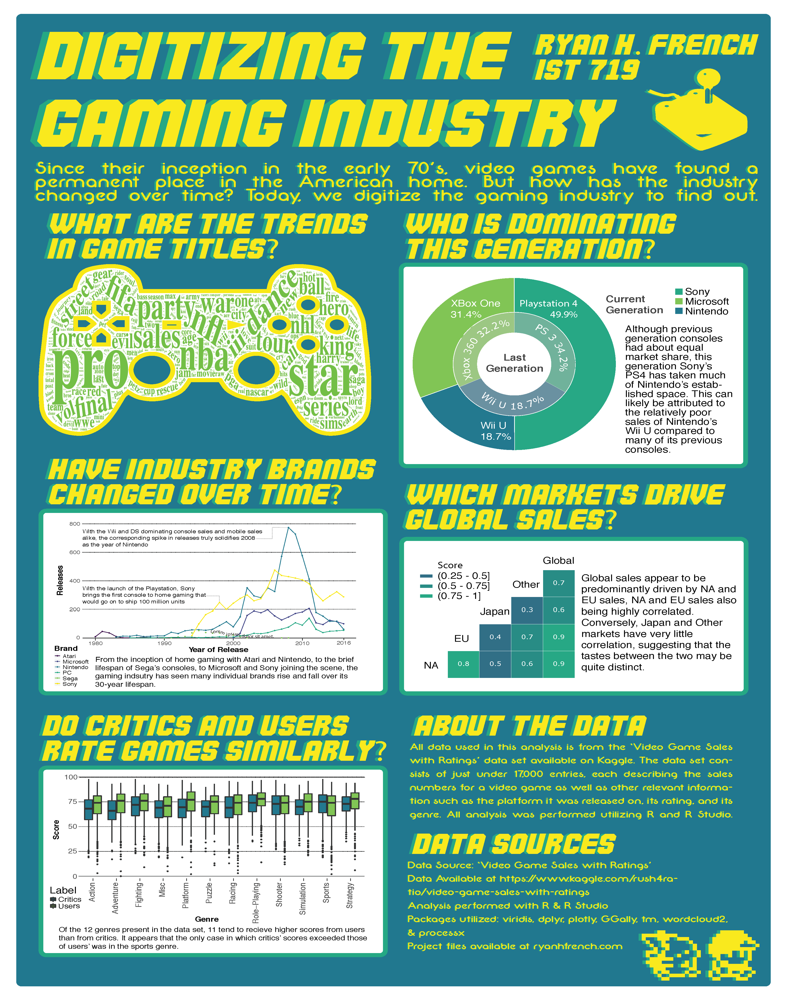

# Analyzing The Gaming Industry Over Time
## Utilizing R & Adobe Illustrator

### Summary
As an avid gamer when I discovered the Video Game Sales dataset on Kaggle (https://www.kaggle.com/rush4ratio/video-game-sales-with-ratings) I was excited to see what different forms of visualizations I could create. In regards to the overall presentation, I wanted to embrace the culture of video games from a stylistic point of view and opted for a retro-themed color scheme and image style.

### Poster

### Files
**resources:** The folder that holds the resources for the poster accents and the wordcloud.  
**visualizations:** The folder that holds the visualization outputs from the R script.  
**Video_Games_Sales.csv:** Data on the video game industry sales for the last 30 years.  
**code.R:** The Script for importing, cleaning, and munging the data from   *Video_Games_Sales_as_at_22_Dec_2016.csv* as well as building the visualizations programmatically.  
**poster.pdf:** The final completed poster from Adobe Illustrator.  
**poster_image.png:** An image of the poster to be displayed on GitHub.  
**poster_project.ai:** The Adobe Illustrator project file for further processing of the visualizations generated in R.  

### Attributes
#### As represented in the MySQL database and Tableau dashboard, definitions provided by Spotify  
**Name:** Name of the game. *(string)*  
**Platform:** Console on which the game is runs. *(string)*      
**Year_of_Release:** The year the game was released. *(int)*     
**Genre:** The game's genre. *(string)*       
**Publisher:** The company responsible for publishing the game. *(string)*       
**NA_Sales:** Game sales in North America (in millions of units). *(float)*      
**EU_Sales:** Game sales in the European Union (in millions of units). *(float)*     
**JP_Sales:** Game sales in Japan (in millions of units). *(float)*         
**Other_Sales:** Game sales in the rest of the world, i.e. Africa, Asia excluding Japan, Australia, Europe excluding the E.U. and South America (in millions of units). *(float)*    
**Global_Sales:** Total worldwide sales (in millions of units). *(float)*     
**Critic_Score:**  Aggregate critics' score of the game compiled by the Metacritic Staff. *(int)*     
**Critic_Count:**  The number of critics used in calculating the *Critic_Score* *(int)*      
**User_Score:**  Metacritic's subscribers' score of the game. *(float)*     
**Developer:**  The party responsible for creating the game. *(string)*     
**Rating:**  The ESRB recommended audience for the game (M, T, E, E10+, etc). *(string)*     
